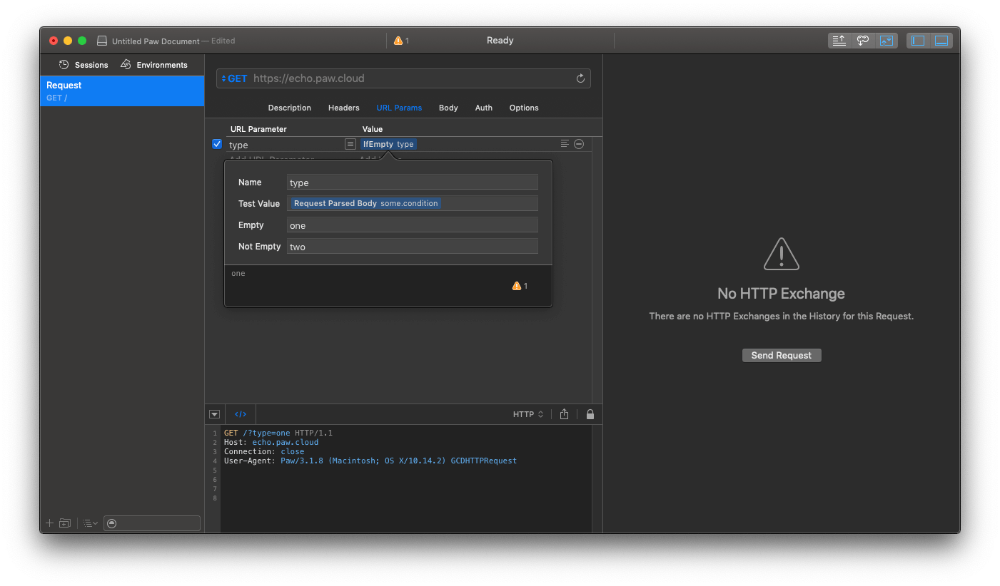

## IfEmptyDynamicValue
A Paw extension to determine if a variable is empty to select a different value.

### Preview

### Install
1. Open Paw's `Preferences` .
2. Select to `Extensions` then click `Open Extensions Directory` .
3. Move `io.chengguo.PawExtensions.IfEmptyDynamicValue` directory to Extensions Directory.

### GitHub
[https://github.com/FingerArt/IfEmptyDynamicValue](https://github.com/FingerArt/IfEmptyDynamicValue)

For [Paw.app](https://paw.cloud)